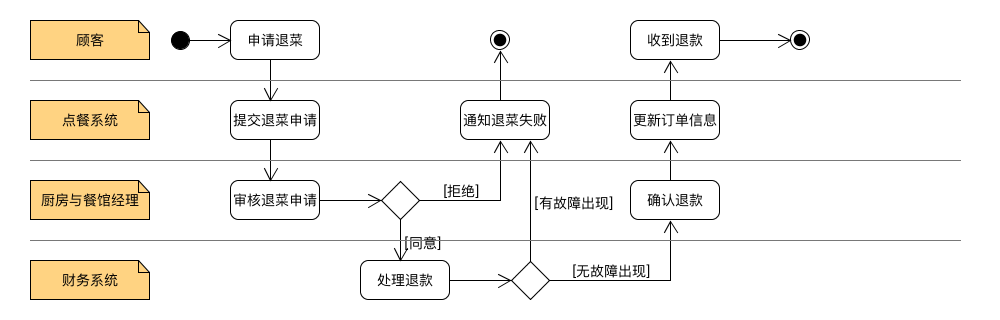
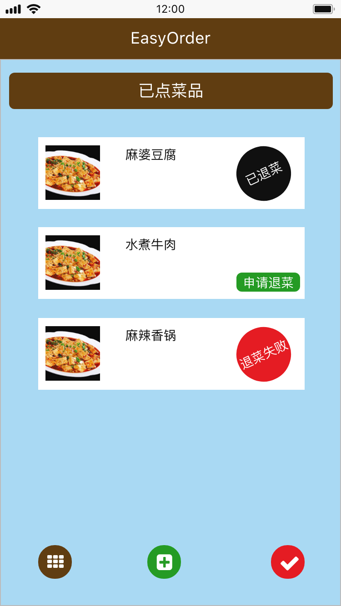
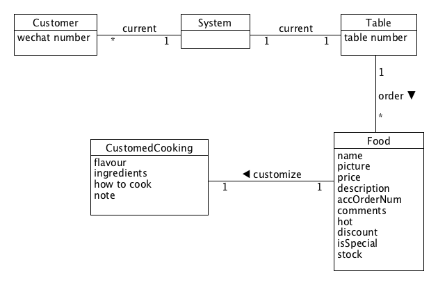

# 需求规格说明

## 6.1 Usecase Diagram

## 6.2 Use Cases

### Brief Level

+ **扫码登陆：** 顾客使用手机微信扫描餐台上的二维码，以餐台号作为 id 登陆进入点餐页面即可进行点餐。
+ **查看餐馆特色：** 顾客点击餐馆详情，可以浏览餐馆详细信息以及各种特色与招牌菜系。
+ **查询推荐菜品：** 顾客点击推荐菜品，可以浏览店主推荐的各种菜品及其详细信息。
+ **搜索菜品：** 顾客可以按照地区、口味、食材等多种类别筛选想要的菜品；也可以通过搜索框直接按关键字搜索菜品。
+ **私人定制：** 顾客可以在每个菜品的定制区设置对已选菜品的做法、口味要求以及材料选择等等，当所选的菜品及其原料和做法拥有充足库存时，系统成功完成私人定制并告知用户；否则，若检测到库存不足等错误，系统将告知用户私人定制失败并说明原因。

### Casual Level

+ **处理退菜：**

    *主成功场景：*
    顾客重新扫描餐台上的二维码进入当前餐台号的点餐页面，点击页面底部“功能菜单”中“已下单的菜品”，选择要退点的菜品，点击“申请退菜”，点餐系统收到退菜要求，马上通知厨房以及餐馆经理，如果符合相关条件，则取消相应菜品的制作，并把钱返还给顾客；点餐系统更新订单信息，相应菜品的订单显示为“已退菜”。

    *交替场景：*
    + 如果厨房告知顾客选择要退的菜品已经上菜或在制作过程中，则不允许顾客退菜并告知退菜失败的原因。
    + 如果退款至顾客账户失败，则提醒用户更换退款账户，重新发起退菜申请或申请现金退款。
    + 如果系统检测到与餐馆记账系统通信失败，则告知用户发生位置错误，请求用户稍后发起退票，将该错误发送给管理员。

    *活动图：*

    

    *UI原型：*

    

### Detailed Level

**范围：** 餐馆扫码点餐应用

**级别：** 用户目标

**主要参与者：** 顾客

**涉众及其关注点：**

- 顾客：希望可以快速浏览菜单找到招牌菜和各种不同菜系；希望便捷、清晰地看到菜品介绍和价格；希望可以迅速点餐而不用排队；希望可以和伙伴一起订菜而不用互相推让菜单；希望有现成套餐可供选择，也可以自己组合套餐；希望可以随时去除已经勾选的菜；希望可以快速了解并享受优惠；希望可以自由选择支付方式、不用排队买单；希望可以自己决定菜品的做法和口味；希望可以中途加菜；希望不会送错菜、漏菜；希望可以按照用餐时的吃菜顺序点餐；希望得到点餐票据，以便核查。
- 厨师：希望可以及时准确地得到顾客订单、具体菜名、口味和做法要求。
- 送餐员：希望可以准确地得到顾客订单、菜品和对应的用餐台号；希望不会送错餐台；希望可以迅速了解不同顾客的付款方式和其他服务要求。
- 经理：希望可以随时随地掌握餐馆工作情况和用餐交易记录，并无需前往餐馆核算。
- 餐馆：希望准确地记录交易，满足顾客要求；希望确保记录了支付授权服务的支付票据。希望能够自动、快速地更新账务和库存信息。

**前置条件：** 网络状况良好，餐馆正常营业

**成功保证：** 存储交易信息，更新账务和库存信息，生成票据，记录支付授权的批准。

**主成功场景（基本流程）：**

1. 顾客入座后，打开手机微信扫描餐台上的二维码，从浏览器进入点餐页面。
2. 系统在对应餐台号码的列表上开始一次新的点餐记录。
3. 系统主界面上的“菜单”栏对当前所处餐馆可点菜品进行分类显示，并且显示每个菜品的价格、缩略图、累积下单数、顾客评价。
4. 顾客挑选所点菜品，加入“餐盘”。
5. 系统逐条记录所点菜品，并显示已选菜品的名称、简单介绍、数量和价格。

**顾客重复4～5步，直到点餐结束。**

6. 点餐完毕，系统显示总价格，顾客点击确认菜品信息
7. 确认无误后，提交订单
8. 顾客点击支付选项，系统显示各种支付方式。
9. 顾客挑选喜欢的支付方式进行付款，系统处理支付。
10. 系统记录完整的菜单和交易信息，并将菜单和餐台号等信息传送到厨房以及送餐员的 POS 机中，厨师开始准备菜品，送餐员准备送餐。
11. 支付完成后，系统打印票据，随后跳转至“评价”页面，等待顾客评价。
12. 顾客获取票据并等待用餐。
13. 顾客用餐结束后，根据自己的体验在“评价”页面对所选菜品和餐馆整体印象进行评价。
14. 顾客完成评价后离开餐馆，系统结束餐台号对应的本次交易。

**扩展（替代流程）**

***a.** 系统在任意时刻失败： 需要完全恢复之前顾客已经预定的订单。

1. 重启系统，确认系统恢复到正常状态
2. 利用之前的记录日志，将系统恢复到崩溃前的状态。

**3a.** 当天有正处于折扣状态的菜品

1. 将其置顶显示，有多个折扣菜品时综合以往顾客的评价从高到低排序显示。
2. 醒目标注其原价，折扣价以及折扣力度。 

**3b.** 餐馆有吸引顾客的“招牌菜”

1. 将其置顶显示，有多个“招牌菜”时综合以往顾客的评价从高到低排序显示。
2. 备注（分类）为“招牌菜”。

**3c.** 餐馆有实惠的组合套餐

1. 将其置顶显示，有多个组合套餐时综合以往顾客的评价从高到低排序显示。
2. 醒目标注套餐适宜多少人食用，附赠的菜品及优惠力度等。

**4a.** 顾客挑选菜品已售完

1. 在前端界面提示顾客该菜品已售完

**4b.** 顾客在挑选时点击该界面上的菜品

1. 显示菜品详细信息，包括菜品大图，菜品详细介绍，口味等。

   **1a.** 菜品无图片信息

   1. 显示默认一张菜品图片， 或者直接显示暂无图片

   **1b.** 菜品暂无相关的详细介绍

   1. 将主界面中的菜品简介显示
   2. 可以给与相关的链接供顾客参考

2. 显示菜品的评分以及销量，供顾客参考

**4c.** 顾客希望直接搜索自己的目标菜品

1. 顾客主界面上的搜索框输入菜名，点击搜索。
2. 系统显示搜索到的菜品详细信息。

    **2a.** 搜索的菜名无相应的菜品

    1. 在前端界面提示顾客搜索不到相应的菜品

**4d.** 顾客的其他伙伴希望加入一起点餐

1. 其他伙伴打开手机微信扫描餐台上的二维码。
2. 系统检测到当前餐台上正在点餐，则不建立新的点餐记录，直接把加入的顾客合并到当前点餐记录中去。
3. 系统在页面的“餐盘”上分别显示当前顾客所选菜品与其他伙伴所选菜品。

**5a.** 选择的菜品数量大于当前库存数量

1. 数据提交时，后台系统发现错误，返回该错误
2. 前端将返回的错误表达给顾客
3. 将“餐盘”中的该菜品数量置为当前库存剩余量

**5b.** 顾客在选择时删去了某菜品的所有数量（即该菜品选择数量为 0）

1. 在“餐盘”中把该菜品栏目项删去

**5c.** 顾客在选择时删去了当前“餐盘”中所有菜品

1. 在“餐盘”中删除所有菜品条目
2. “餐盘”不显示

**5d.** 顾客在选择了一些商品后误退出了该页面

1. 页面在顾客选择时记录选择信息
2. 在顾客重新进入时恢复顾客之前的选择

**6a.** 顾客发现点菜错误

1. 重新返回点菜界面，并在“餐盘”中显示之前点过的菜

**6b.** 顾客希望某些菜品可以根据自己的口味要求来制作

1. 顾客在备注一栏填写自己对于各个菜品的制作要求
2. 系统把顾客的要求一起添加到订单中

**7a.** 提交订单之后顾客希望取消订单

1. 顾客提交取消申请，由前端发送数据到后台系统
2. 系统处理，在餐馆显示界面及时取消显示该订单

**8a.** 不同支付方式支付

**8b.** 订单提交之后，支付超时

1. 执行取消订单操作
2. 在餐馆显示页面去除该订单信息。

**13a.** 顾客用餐结束后不想进行任何评价

1. 顾客直接关闭点餐页面。

## 6.3 Domian Model

### 私人定制功能领域模型 (By Jack Cheng: 15331050)

## 6.4 State Model

### 建模理由

+ 状态模型可以帮助我们从实例的角度识别业务事件，完善、优化业务过程的细节，细化业务过程与领域模型
+ 状态模型可以给出业务过程合理性与完备性验证
+ 状态模型可以为程序开发提供业务规范细节

在我们的项目中，点餐订单、中途加菜订单、退菜订单是客户最为关注的业务交易实体，因为他们关系到客户的切身利益和用餐服务体验，因此非常有必要对这三种订单进行建模。

### 建模方法

在对三个重要的订单业务实体进行状态建模时，我们主要是从已经设计好的各种用例识别出业务实体的状态，并追溯产生这种状态的原因来寻找相应的条件、事件和动作，在此基础上来构建我们的状态模型。

### 建模结果

#### 点餐订单状态模型

#### 中途加菜订单状态模型

#### 退菜订单状态模型

## 6.5 System Sequence Diagram

### 应用场景一：顾客私人定制菜品 (By Jack Cheng: 15331050)

