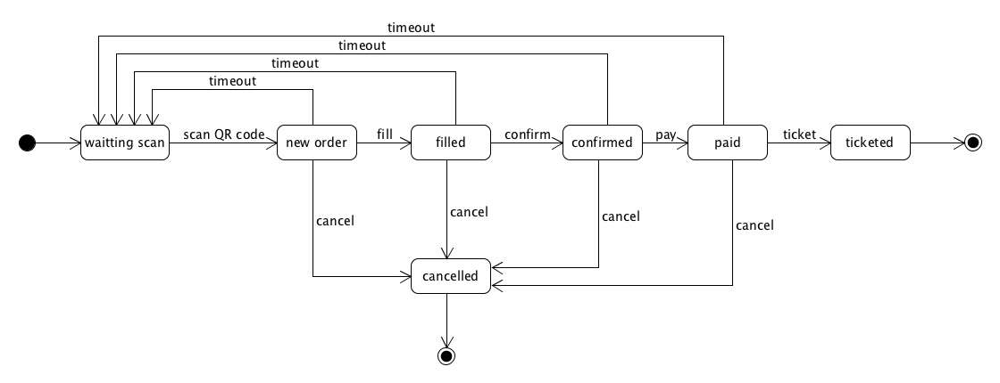
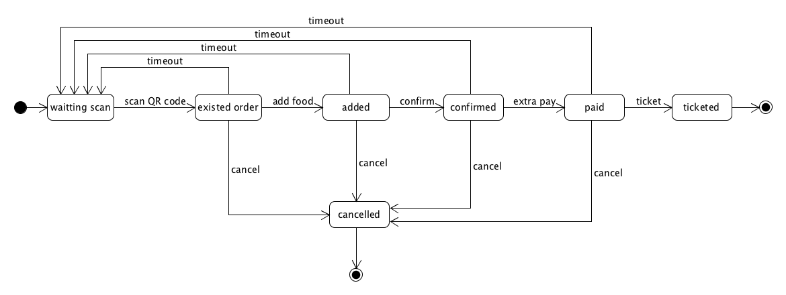
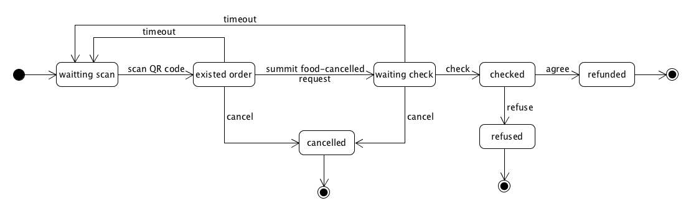

## 6.4 State Model

### 建模理由

- 状态模型可以帮助我们从实例的角度识别业务事件，完善、优化业务过程的细节，细化业务过程与领域模型
- 状态模型可以给出业务过程合理性与完备性验证
- 状态模型可以为程序开发提供业务规范细节

在我们的项目中，点餐订单、中途加菜订单、退菜订单是客户最为关注的业务交易实体，因为他们关系到客户的切身利益和用餐服务体验，因此非常有必要对这三种订单进行建模。

### 建模方法

在对三个重要的订单业务实体进行状态建模时，我们主要是从已经设计好的各种用例识别出业务实体的状态，并追溯产生这种状态的原因来寻找相应的条件、事件和动作，在此基础上来构建我们的状态模型。

### 建模结果

#### 点餐订单状态模型

#### 中途加菜订单状态模型

#### 退菜订单状态模型

