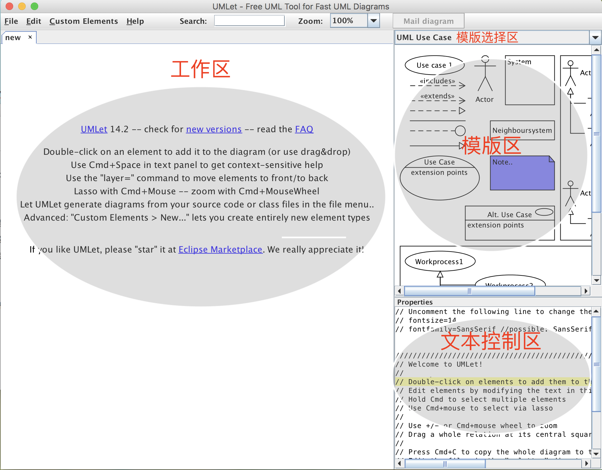
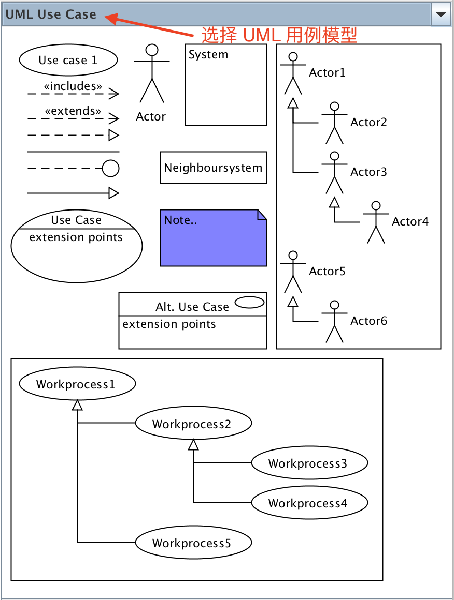
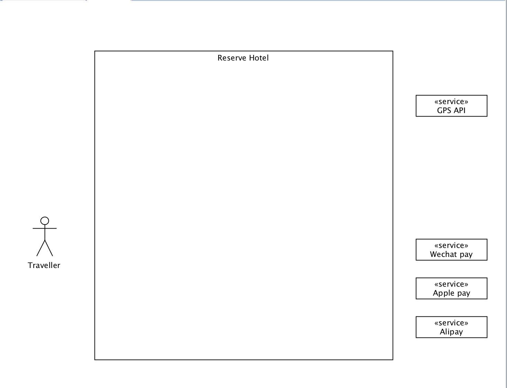
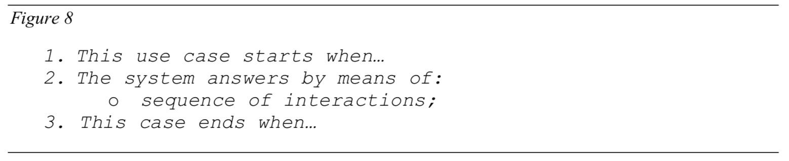
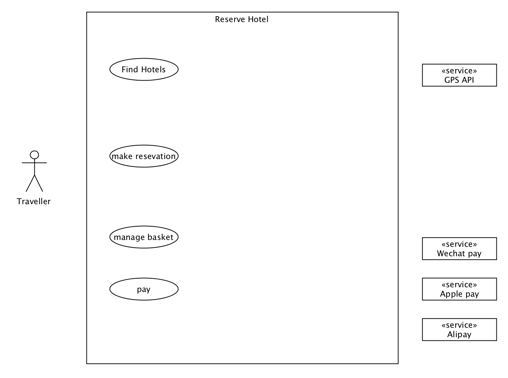
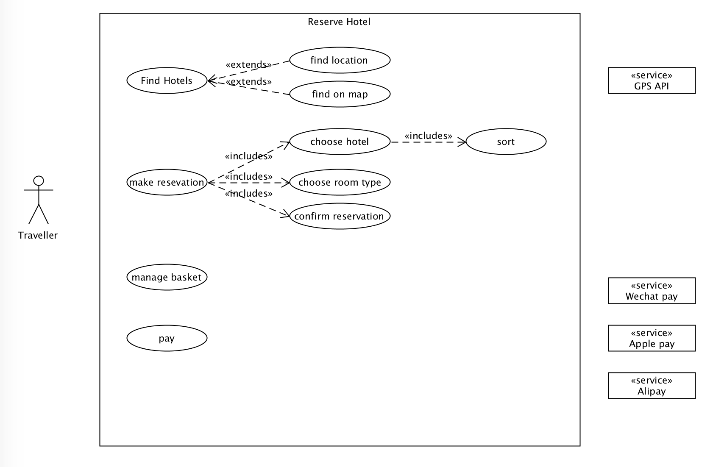

# UMLet 使用说明之绘制用例图

UMLet 是一款简单实用、开源的轻量级 UML 建模工具，它能够帮助我们快速地构建 UML 用例图、UML 静态图、UML 行为图和 UML 实现图等各种 UML 模型。UMLet 可以在 Windows、OS X 和 Linux 上独立运行，与大型软件 Visio 相比，更加灵活轻便，易于安装。

## 安装

1. 运行 UMLet 需要电脑上安装有 `java` 运行环境，可以前往 [Oracle 官网](http://www.oracle.com/technetwork/java/javase/downloads/index.html) ，根据自己的电脑系统下载相应的 `JDK`。

2. 安装好 `java` 运行环境后，前往[UMLet官网](http://umlet.com/changes.htm)下载相应的安装包，目前最新版本为 `UMLet 14.2 stand-alone` ，下载完成后进行解压。

3. 如果是 Windows 系统，直接在解压的目录内双击 “**Umlet.exe**” 或者 ”**Umlet.jar**“ 即可打开；如果是 Linux 或者 OS X 系统，则在解压目录下打开终端，输入如下命令即可打开：

```shell
$ java -jar umlet.jar
```


## 主要界面

UMLet 的主要界面如下：



我们主要使用的是四个区：

+ **工作区**：用于绘制各种 UML 模型图。
+ **模版选择区**：用于选择 UML 的各种模版。
+ **模版区**：绘制模型图的元素绝大部分都要从模版区中选择并拖拽出去。
+ **文本控制区**：用于编写 UML 元素的属性，如类名称、字段、方法、背景色等等。

## 绘制用例图

首先，在模版选择区选择 `UML Use Case` 模版获取所有用例图的元素：



下面，我们将使用一个简单的酒店预定系统 `Reserve Hotel` 来展示 UML 用例图主要元素的使用及绘制。

### 创建系统

在 UML 模型中，一个系统代表一个应用，它包含了自己的名字以及所有合适的用例，通常用一个矩形代表一个系统。在 UMLet 中，把 `System` 元素拖拽到工作区中某个位置，然后在文本控制区中把系统的名字改成 `Reserve Hotel` ，把标题改成位于中间：


### 添加 Actors

一个 `Actor` 元素代表与系统进行交互的一个外部实体（可以是人或者其他外设），每一个 `Actor` 都必须至少参与一个 `Use case` 。`Actor` 主要分为如下两类：

+ **`main actor`**：使用系统的各种用例，并且能够查看系统返回的用例执行结果，在用例图中用一个小人的图形来表示。
+ **`secondary actor`**：用于辅助系统完成其他必要的外部功能，如第三方支付功能、定位功能等，在用例图中用一个矩形和用 `<<>>` 括起来的属性来表示。

我们这个酒店预定系统的 `main actor` 只有一个，就是客户，我们将其命名为 `Traveller` 。而 `secondary actor` 主要有：

+ `GPS` 定位服务，方便用户查找酒店位置
+ `Wechat pay` 第三方支付服务，支持微信支付
+ `Apple pay` 第三方支付服务，支持苹果支付
+ `Alipay` 第三方支付服务，支持支付宝支付

把各个 `Actors` 添加进工作区中，注意 `main actor` 一般置于系统的左边，`secondary actor` 一般置于系统的右边：



### 添加 Use case

一个 `Use case` 代表了系统与用户进行交互的**一组动作序列**（注意是一组动作而不是一个动作！），系统在完成该组动作序列后将会产生相应的结果返回给参与到该用例中的 `Actors` 。每一个 `Use case` 都必须具有如下过程：



总体上说，每一个 `Use case` 都代表了系统所提供给用户的一项服务，因此，`Use case` 的名字必须以动词开头！在 UML 用例图中，`Use case` 主要使用一个椭圆来表示。

在我们的酒店预定系统中，主要有以下的 `Use case` ：

+ `Find Hotels` ，用户查询并选择自己满意的酒店。
+ `Make reservation` ，用户订购酒店。
+ `Manage basket` 用户管理自己的订购信息。
+ `Pay` 支付酒店费用。

在 UMLet 的模版选择区中选择相应数量的 `Use case` 元素添加到 `Reserve Hotel` 系统的方框中，并修改为相应的名字：



### includes：包含其他 Use case

一个 `Use case` 可以包含其他的 `Use case` 。如果 `Use case B includes Use case A` ，则我们说 `Use case B` 依赖于 `Use case A` ，也就是说要完成 `Use case B` 中的所有动作，必须要完成 `Use case A` 中的所有动作，即 `Use case A` 中的动作序列是 `Use case B` 中不可或缺的。包含操作在 UML 用例图中使用一个上方标记有 `<<includes>>` 的虚线箭头 `---->` 来表示，没有箭头的一端表示**包含者 (includes)**，有箭头的一端表示**被包含者 (included)**，如在上例中表示为 `Use case B (includes)------> Use case A`。

在我们的酒店预定系统中，`make reservation` 这个 `Use case` 需要包含 `choose hotel` 、`choose room type` 、`confirm reservation` 三个 `Use case` ，分别实现预定酒店过程中需要实现的选择酒店、选择房间类型、确认订单的子服务；而在选择酒店的过程中，会涉及到根据以往用户的反馈对各种酒店进行排名的问题，因此 `choose hotel` 也应该包含一个 `sort` 的 `Use case`。我们把所有被包含的 `Use case` 也添加进用例图中：


### extends：扩展其他 Use case

对于某些用例来说，在完成基本功能的前提下，还可以提供一些额外的**可选的（非必需）**功能，这个时候可以把这些**可选的**功能转化成另一些 `Use case` ，然后作为扩展功能补充到原来的 `Use case` 中去。如果 `Use case A extends Use case B`，则说明 `Use case A` 中实现的功能可以作为可选的功能添加到 `Use case B` 中去。扩展操作在 UML 用例图中使用一个上方标记有 `<<extends>>` 的虚线箭头 `---->` 来表示，没有箭头的一端表示扩展的用例 (extends)，有箭头的一端表示被扩展的对象 (extended)，如在上例中表示为 `Use case A (extends)------> Use case B`。

在我们的酒店预定系统中，一般情况下用户会根据酒店的名字来获得 `Find Hotels` 这个服务，但是有时候，用户可能会希望通过指定地址和搜索地图的方式来找到自己满意的酒店，因此应该把 `find location` 和 `find on map` 这两个可选的 `Use case` 添加到 `Find Hotels` 的扩展功能中去。我们把所有扩展的 `Use case` 也添加进用例图中：



### 联系 Use case 与 Actors

到目前为止，我们已经基本上把 `Reserve Hotel` 系统的所有元素都添加进用例图中了。前面已经说过，每一个 `Actor` 都必须至少参与一个 `Use case` ，因此我们把 `Use case` 与 `Actors` 联系起来。联系使用一个长实线 `——————` 表示，意思是 "take part in"。

在我们的酒店预定系统中，`Traveller` 需要参与到 `Find Hotels` 、`make reservation` 、`manage basket` 、`pay` 这四个 `Use case` 中去， `GPS API` 需要参与到 `find on map` 中去，三个第三方支付 `Actor` 则需要参与到 `pay` 中去，因此我们使用长实线把这些实体和 `Use case` 联系起来：


### 改变 Use case 的属性

我们可以通过在文本控制框输入一些控制指令来改变 Use case 的属性，比如在我们的酒店预定系统中，`GPS API` 以及第三方支付服务这些 `Actors` 需要用到专门的技术，我们想把它们的背景变成黄色。点击这些 `Use case` ，在它们的文本控制框中输入指令 `bg=yellow` 即可把它们的背景变成黄色：


经过以上所有过程，我们成功地绘制了关于 `Reserve Hotel` 系统的一个简单用例图。

## 总结

以上是我个人在学习使用 UMLet 工具进行 UML 建模时进行的一个实践，利用这篇博客来进行总结，希望能对学习 UML 的童鞋有所帮助。

## 参考网站

1. http://www.upg-bulletin-se.ro/archive/2006-4/6.%20Dumitrascu%20UML%20II.pdf
2. http://www3.travel.com.au/hotels.html
3. https://www.awaimai.com/1448.html