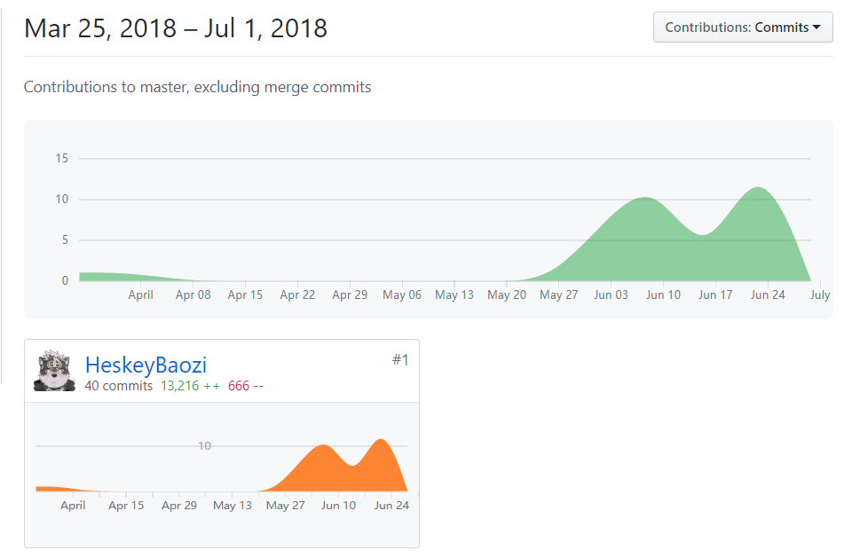
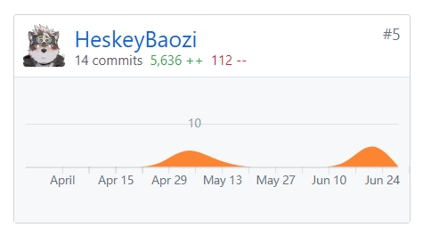

# By 15331097 [@HeskeyBaozi](https://github.com/HeskeyBaozi)

## 苦劳工作清单

|         最有价值的工作         |              简短说明                   |
| :--------------------------: | :------------------------------------:|
| 前端代码的编写与维护      | 负责对接前端后台接口，负责前端代码编写，负责前端代码质量维护，负责前端功能增量更新，拥抱变化   |
| 项目基础设施搭建            | 建立持续集成工作流、维护网站文档            |
| 前端数据流的设计 | 包括`Redux`和`Mobx-State-Tree`状态树的设计  |
| 用户UI界面的设计      | 包括各个页面的设计、参考各大点餐软件案例   |

## 个人博客清单

[link: 自制主题技术博客](https://heskeybaozi.github.io/#/)

## 个人`Github`贡献

### EasyOrder-FE 客户端

[link: https://github.com/OOAD-Project/EasyOrder-FE/graphs/contributors](https://github.com/OOAD-Project/EasyOrder-FE/graphs/contributors)

### DashBoard 文档

[link: https://github.com/OOAD-Project/DashBoard/graphs/contributors](https://github.com/OOAD-Project/DashBoard/graphs/contributors) 

## 个人软件过程

|         PSP 2.1          |               How to do                | Time(hours) |
| :----------------------: | :------------------------------------: | :---------: |
|         Planning         |                  分析前端数据流，预想`API`实现                  |      4      |
|         Estimate         |         评估前端代码数据结构使用复杂度         |      2      |
|         Analysis         |                分析需求                |     15      |
|       Design Spec        |              生成设计文档              |      5      |
|      Design Review       |     设计复审（单人复审）     |      0      |
|     Coding Standard      | 代码规范（为目前的开发制定合适的规范） |      0      |
|          Design          |                具体设计                |     15      |
|       Development        |                  前端开发（`React`技术栈）   |    80.5     |
|       Code Review        |                代码复审（前端持续集成，包括风格检查、代码复用检查、模块化检查）                |      0      |
|           Test           |  测试（主要是接口调用的测试）  |     3.5     |
|     Size Measurement     |               计算工作量               |      0      |
|        Postmortem        |                事后总结                |      1      |
| Process Improvement Plan |            提出过程改进计划            |      2      |
