# 小组各成员的项目期末报告

## 贡献图

**DashBoard 贡献图：**

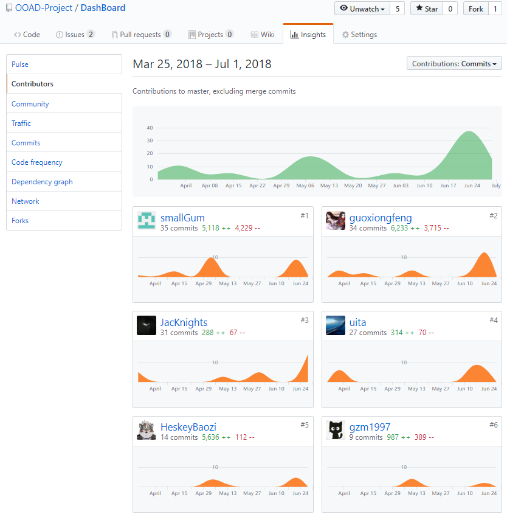

**EasyOrder_BE 贡献图：**

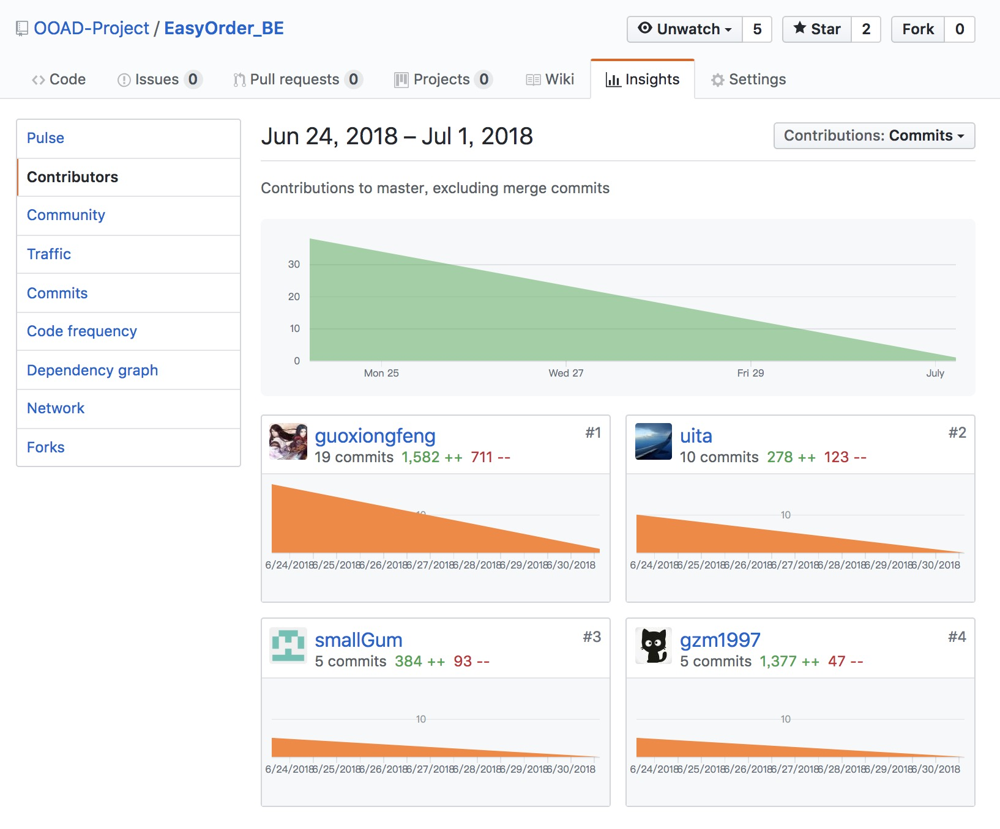


## By 15331050

### 自我总结

#### 项目反思

在这次项目的设计中我负责需求分析、用例设计、后端编码等工作，总的来说并不顺利。在需求分析和用例设计时无法考虑得全面和细致，导致在后端编码的时候需要一边编码一边回头来修改文档，给团队带来了很多麻烦，这应该是软件开发的大忌。总的来说，自己在软件需求分析方面确实需要不断改进，对于软件工程的知识还掌握得不够，必须参与到更多的实践中不断成长。

#### 项目感悟

需求分析和设计是整个软件开发过程的基石，文档的清晰和完备是降低沟通成本的最有效方法，合理的文档结构和成员分工是项目进度的保证。

#### 特别鸣谢

前端大佬、后端伙伴以及我们的架构工程师、产品经理和项目经理。

### PSP 2.1 统计表

|         PSP 2.1          |               How to do                | Time(hours) |
| :----------------------: | :------------------------------------: | :---------: |
|         Planning         |                  计划                  |      4      |
|         Estimate         |         估计自己的任务所需时间         |      4      |
|       Development        |                  开发                  |    47.5     |
|         Analysis         |                分析需求                |     15      |
|       Design Spec        |              生成设计文档              |     12      |
|      Design Review       |     设计复审（和同事审核设计文档）     |      4      |
|     Coding Standard      | 代码规范（为目前的开发制定合适的规范） |     0.5     |
|          Design          |                具体设计                |      0      |
|          Coding          |                具体编码                |      4      |
|       Code Review        |                代码复审                |      2      |
|           Test           |  测试（包括自测，修改代码，提交修改）  |      2      |
|       Test Report        |                测试报告                |      0      |
|          Report          |                  报告                  |      4      |
|     Size Measurement     |               计算工作量               |      0      |
|        Postmortem        |                事后总结                |      2      |
| Process Improvement Plan |            提出过程改进计划            |      2      |
|           Sum            |                  合计                  |    55.5     |

### 个人 GIT 统计报告

由于我们组采用的是建立Organization然后共同管理的方式，因此统计只能分别截图。我负责的工作主要是需求分析和开发设计文档的编写、后端部分代码的开发，个人的 git 统计情况如下：

#### commit

**DashBoard commit 记录：**

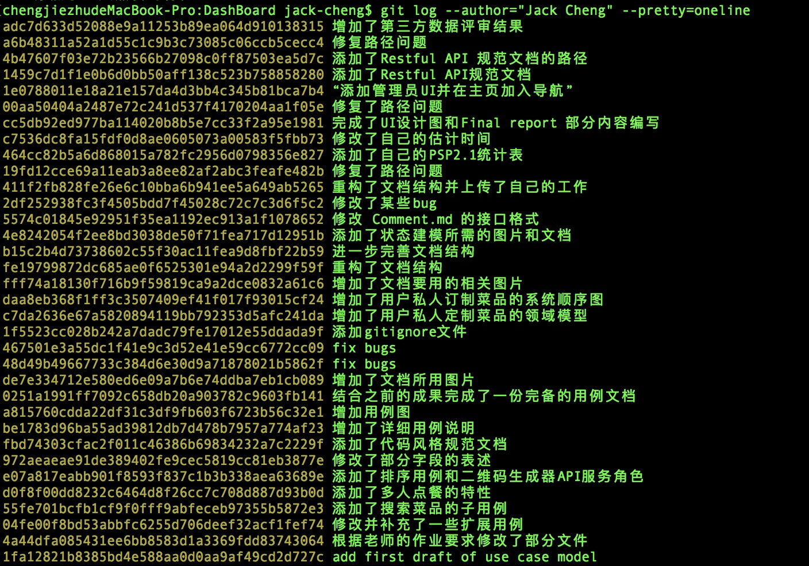

**DashBoard commit 数量：**

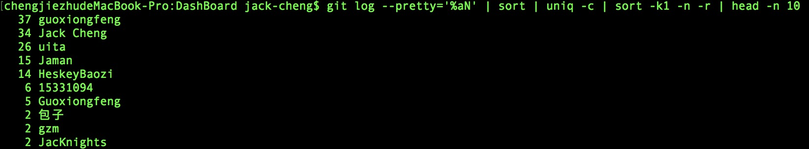

如图所示，本人 (**Jack Cheng**) 的 commit 数量为 34。

**EasyOrder_BE commit 记录：**

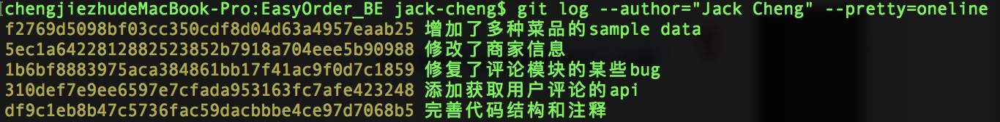

**EasyOrder_BE commit 数量：**

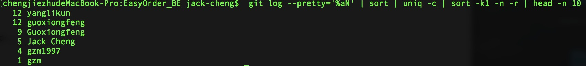

如图所示，本人 (**Jack Cheng**) 的 commit 数量为 5。

#### 代码行数统计

**DashBoard 代码行数统计：**

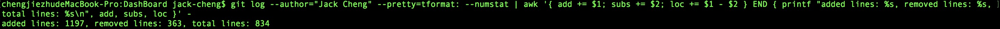

**EasyOrder_BE 代码行数统计：**

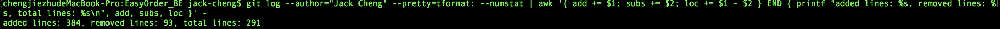

#### github 每个仓库的统计图

由于本人 (**Jack Cheng**) 只在 `DashBoard` 和 `EasyOrder_BE` 仓库上有贡献，因此只列出这两个仓库内的贡献图：


### 苦劳工作清单

|         最有价值的工作         |              简短说明                   |
| :--------------------------: | :------------------------------------:|
| 编写了项目的详细用例            | 主成功场景以及各种扩展场景的编写            |
| 各种用例图、领域模型状态模型的绘制 | 使用UMLet工具把具体需求和业务流程可视化  |
| 完成了用户评论API的代码编写      | 使用restful方式接收和返回用户对菜品的评论   |

### 个人博客清单

[UMLet 使用说明之绘制用例图](https://blog.csdn.net/jack_cjz/article/details/79934805)


--------------


## By 15331092

### 课程学习自我总结

在系统分析设计这门课上， 我学到的最多的部分应该是各种UML图的设计与绘制。我觉得一个好的设计必然也能美观的体现在一个UML图上。

在这个大作业中我主要负责的也是设计部分， 所以就主要总结一下设计的一些心得。


### 项目设计需要包含的部分

1. 数据库表的设计。这个设计主要依赖的是数据库的领域模型。领域模型是在项目初期建立的。所以在具体写代码的时候，会常常发现之前建立的领域模型并不合适。然后需要修改，花费的时间，人力成本都挺大的，但是一开始又的确想不出完整的方案。

2. 前后端交互数据设计（API设计）

   这部分是我这次项目中主要完成的部分。但是这之中也遇到了一个问题： 究竟应该是前端来定义交互的数据结构还是后端？ 这次的的方案中我们采用的是前后端都各自定义自己使用较为频繁的数据。

### 项目设计需要注意的一些点

1. 不要怕开始的设计有问题。因为基本上一定会有问题。。。需要做的就是和开发者（前端和后端）保持沟通， 然后修改自己的数据库表项&API。
2. API设计必须先于前后端的开发设计。这次项目中我犯得一个比较大的错误就是API设计完成的比较晚， 导致前后端似乎分别采用了一套API—— 这样在对接的时候十分麻烦， 必然有一边需要改。

### 一些体会

- 设计没有想象的那么轻松，甚至比编码累。因为设计的时候必须想清楚整个过程需要哪些量，数据类型应该定义为什么比较合适。
- 设计的时候最好先画图，即课上所学过的UML图。 这样可以使设计的时候思路保持清晰而不至于太混乱。

------

### PSP 

|         PSP 2.1          |               How to do                | Time(hours) |
| :----------------------: | :------------------------------------: | :---------: |
|         Planning         |                  计划                  |      4      |
|         Estimate         |         估计自己的任务所需时间         |      2      |
|       Development        |                  开发                  |    59.5     |
|         Analysis         |                分析需求                |     15      |
|       Design Spec        |              生成设计文档              |      5      |
|      Design Review       |     设计复审（和同事审核设计文档）     |      3      |
|     Coding Standard      | 代码规范（为目前的开发制定合适的规范） |      0      |
|          Design          |                具体设计                |     15      |
|          Coding          |                具体编码                |     12      |
|       Code Review        |                代码复审                |      0      |
|           Test           |  测试（包括自测，修改代码，提交修改）  |     3.5     |
|       Test Report        |                测试报告                |      0      |
|          Report          |                  报告                  |      3      |
|     Size Measurement     |               计算工作量               |      0      |
|        Postmortem        |                事后总结                |      1      |
| Process Improvement Plan |            提出过程改进计划            |      2      |
|           Sum            |                  合计                  |    65.5     |

### Git统计报告

##### DashBoard:


##### 后端


由于我们组采用的是建立Organization然后共同commit的方式，因此统计只能分别截图。

首先是代码行数统计,代码如下：

```shell
git log --format='%aN' | sort -u | while read name; do echo -en "$name\t"; git log --author="$name" --pretty=tformat: --numstat | awk '{ add += $1; subs += $2; loc += $1 - $2 } END { printf "added lines: %s, removed lines: %s, total lines: %s\n", add, subs, loc }' -; done
```

然后是commit数量，代码如下：

```shell
git log --pretty=%aN | sort | uniq -c | sort -k1 -n -r | head -n 10
```

我主要负责的是设计与开发文档编写以及部分后端开发工作，截图**DashBoard**（文档repository）和**EasyOrder_BE**（后端repository）如下：

**DashBoard **代码行数：

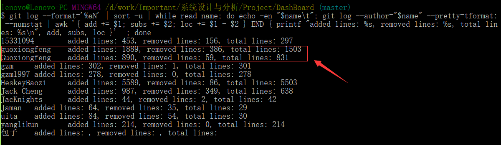

**DashBoard** commit数：

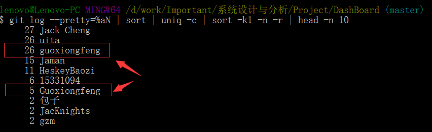

**EasyOrder_BE **代码行数：

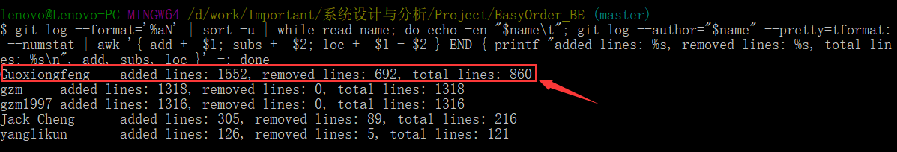

**EasyOrder_BE** commit数：

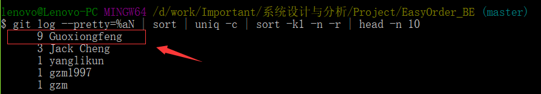


### 工作清单 & 博客地址

#### 工作介绍（一句话）：主要负责了这次项目的大部分api接口设计， 部分后端的api实现以及文档编写。

### 苦劳工作清单

|         最有价值的工作         |                          简短说明                          |
| :----------------------------: | :--------------------------------------------------------: |
|        大部分API的设计         |    用于前后端对接，规定各个部分的接口， 确保数据流正常     |
|       部分API的代码实现        |               后台管理端部分的所有API的实现                |
| 部分数据库字段设计与用例的补充 | 设计了部分数据库表，并且在用例的基础上添加了一些子用例说明 |

#### 博客地址：[15331092_项目工作经验总结](https://blog.csdn.net/guo15331092/article/details/79952894)


---------------

## By 15331097

[@HeskeyBaozi](https://github.com/HeskeyBaozi)

### 苦劳工作清单

|         最有价值的工作         |              简短说明                   |
| :--------------------------: | :------------------------------------:|
| 前端代码的编写与维护      | 负责对接前端后台接口，负责前端代码编写，负责前端代码质量维护，负责前端功能增量更新，拥抱变化   |
| 项目基础设施搭建            | 建立持续集成工作流、维护网站文档            |
| 前端数据流的设计 | 包括`Redux`和`Mobx-State-Tree`状态树的设计  |
| 用户UI界面的设计      | 包括各个页面的设计、参考各大点餐软件案例   |

### 个人博客清单

[link: 个人自制主题技术博客](https://heskeybaozi.github.io/#/)

### 个人`Github`贡献

#### EasyOrder-FE 扫码前端

[link: https://github.com/OOAD-Project/EasyOrder-FE/graphs/contributors](https://github.com/OOAD-Project/EasyOrder-FE/graphs/contributors)

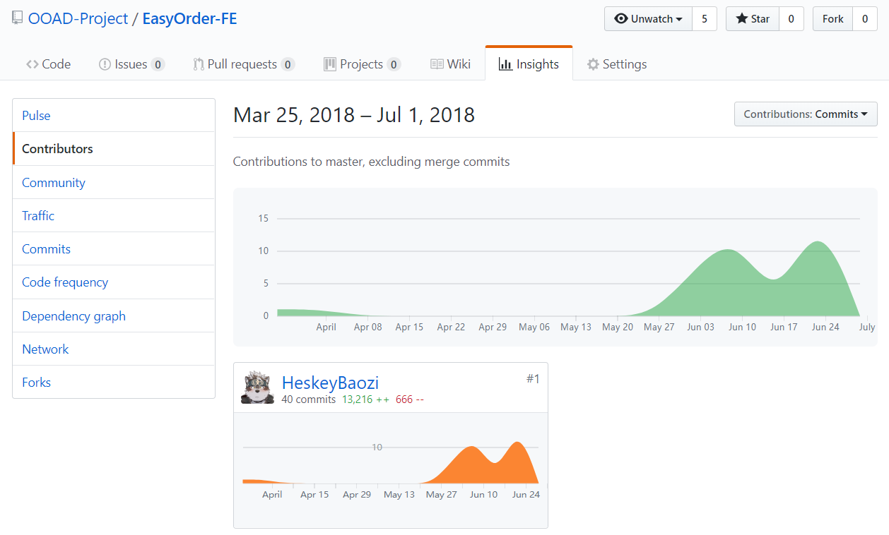

#### Admin-FE 管理员前端

[link: https://github.com/OOAD-Project/Admin-FE/graphs/contributors](https://github.com/OOAD-Project/Admin-FE/graphs/contributors)

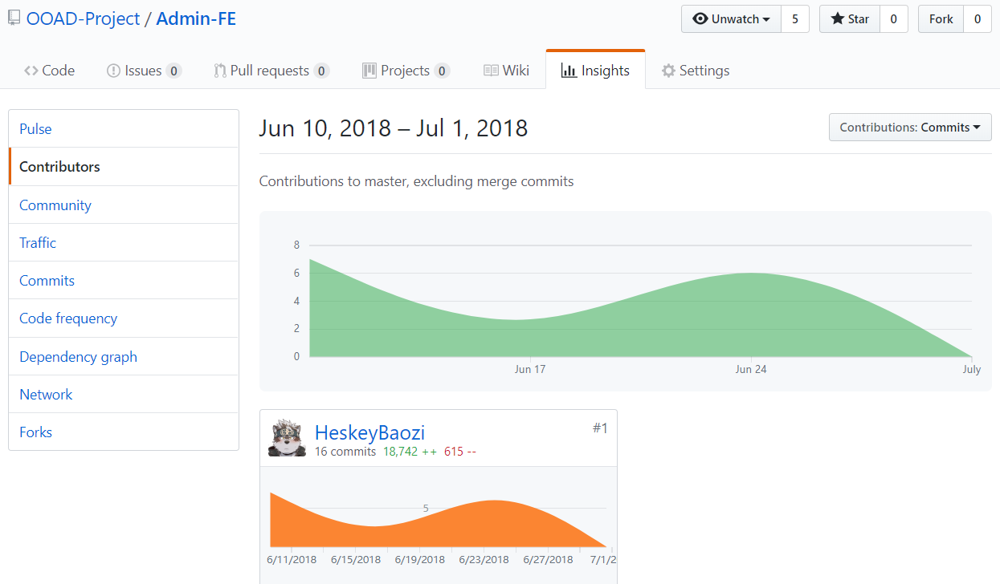

#### DashBoard 文档

[link: https://github.com/OOAD-Project/DashBoard/graphs/contributors](https://github.com/OOAD-Project/DashBoard/graphs/contributors) 


### 个人软件过程

|         PSP 2.1          |               How to do                | Time(hours) |
| :----------------------: | :------------------------------------: | :---------: |
|         Planning         |                  分析前端数据流，预想`API`实现                  |      4      |
|         Estimate         |         评估前端代码数据结构使用复杂度         |      2      |
|         Analysis         |                分析需求                |     15      |
|       Design Spec        |              生成设计文档              |      5      |
|      Design Review       |     设计复审（单人复审）     |      0      |
|     Coding Standard      | 代码规范（为目前的开发制定合适的规范） |      0      |
|          Design          |                具体设计                |     15      |
|       Development        |                  前端开发（`React`技术栈）   |    80.5     |
|       Code Review        |                代码复审（前端持续集成，包括风格检查、代码复用检查、模块化检查）                |      0      |
|           Test           |  测试（主要是接口调用的测试）  |     3.5     |
|     Size Measurement     |               计算工作量               |      0      |
|        Postmortem        |                事后总结                |      1      |
| Process Improvement Plan |            提出过程改进计划            |      2      |


------------------------

## by-15331087

### [个人报告链接](https://github.com/OOAD-Project/DashBoard/blob/master/X3_Final_Report/FinalReport_15331087.md)

### 课程项目中我的工作

在这学期系统分析与设计课上，我学到了是UML各类型图的设计思想与绘制方法，并初步将其应用于项目的实际开发中以增强抽象逻辑的表达能力，从而更良好地与组员在系统的分析及设计上交流思想，统一观点，减少设计误差。

在本次课程项目EasyOrder扫码点餐系统中，我主要负责了最初的项目主题的确立（扫码订餐项目及命名EasyOrder等），项目早期的系统需求分析和实地调研（收集现有的餐馆扫码点餐产品的用例及流程），参与了系统整体框架设计（顾客与餐馆两方与EasyOrder系统的交互界面）。本来按初步计划我还将重点参与系统后端编码过程，后来学期末因为学业上其它事情耽搁，所以减少了这部分的工作量。在此感谢后端开发的其他几名同学的体谅与分担。

### 在实际项目开发中的经验与教训

1. 早期的需求分析很重要。第一阶段必须确定好系统用例和功能，切忌到了后期再修改需求。关于这点，UML图就能发挥大作用。组员之间对于系统的期望肯定会有不同意见，故初期就应该通过统一的语言把需求唯一化，避免模糊的需求分析导致后期的前后端以及数据库的设计实现出现偏差。
2. 编码未动，文档先行。实际开发中我们遇到了一个比较棘手的问题是前后端以及数据库的字段名和字段类型的不统一，导致三方的通信常常不能按预期被解析，表现为访问网站以及提交表单的结果返回为500系统错误。我在此得到的教训是以后的项目开发应该要先由一方制定好API文档，文档中明确写清字段名和类型等细节，其它模块的设计者就严格遵守对方的文档来设计通信，避免再用口头表述等方式交流或者忽视设计文档。
3. 总之就是，我们不能再抱着以前一个人设计并实现一个小程序的心态去和团队完成大项目而埋头于敲代码，而应该重视分析与设计的里程碑图表和文档，并严格遵守确立的规范来开发项目。


------

### PSP 

|         PSP 2.1          |               How to do                | Time(hours) |
| :----------------------: | :------------------------------------: | :---------: |
|         Planning         |                  计划                  |      5      |
|         Estimate         |         估计自己的任务所需时间         |      2      |
|       Development        |                  开发                  |     37    |
|         Analysis         |                分析需求                |     10      |
|       Design Spec        |              生成设计文档              |     10      |
|      Design Review       |     设计复审（和同事审核设计文档）     |      2      |
|     Coding Standard      | 代码规范（为目前的开发制定合适的规范） |      0      |
|          Design          |                具体设计                |      5      |
|          Coding          |                具体编码                |      2      |
|       Code Review        |                代码复审                |      0      |
|           Test           |  测试（包括自测，修改代码，提交修改）  |      0     |
|       Test Report        |                测试报告                |      0      |
|          Report          |                  报告                  |      5      |
|     Size Measurement     |               计算工作量               |      0      |
|        Postmortem        |                事后总结                |      2      |
| Process Improvement Plan |            提出过程改进计划            |      1      |
|           Sum            |                  合计                  |     44     |

### 苦劳工作清单

|         最有价值的工作         |              简短说明                   |
| :--------------------------: | :------------------------------------:|
| 分析系统用例并绘制了项目的用例图 | 顾客点餐过程中的用例以及商家管理过程中的用例  |
| 业务流程文档编写 | 实地调研获取市场上现有的扫码点餐系统的业务流程信息并写成文档  |
| 参与系统功能分析与创新点设计  | 在现有的众多扫码点餐产品中争取崭露头角   |
| 编写系统架构部署文档      | 分析系统架构，将前后端与数据库的关系转为文档展示   |

### Insights

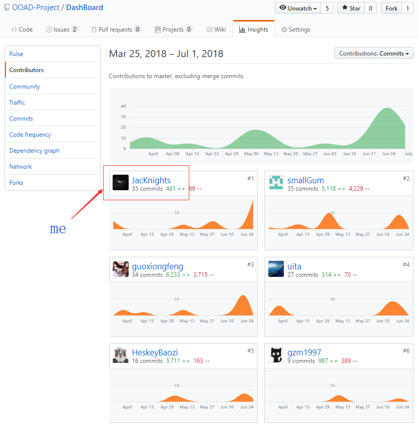

### Git统计报告

commit数量代码如下：

```shell
git log --pretty=%aN | sort | uniq -c | sort -k1 -n -r | head -n 10
```

我主要负责需求分析与设计过程中，UML图与文档编写，故截图**DashBoard**（项目文档仓库）如下：

**DashBoard** commit数：

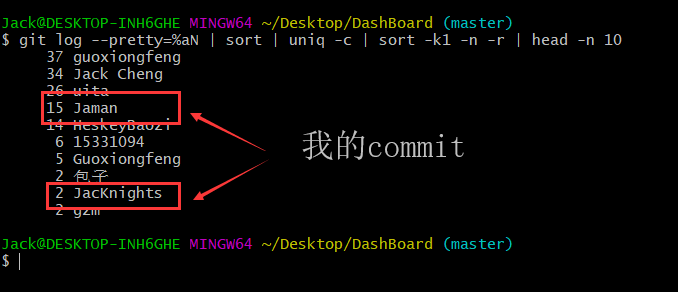

代码行数统计,代码如下：

```
git log --format='%aN' | sort -u | while read name; do echo -en "$name\t"; git log --author="$name" --pretty=tformat: --numstat | awk '{ add += $1; subs += $2; loc += $1 - $2 } END { printf "added lines: %s, removed lines: %s, total lines: %s\n", add, subs, loc }' -; done
```

**DashBoard **代码行数：

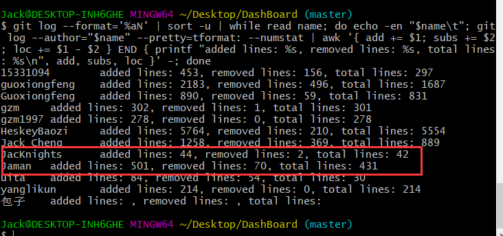


## By 15331361

### 项目感悟

+ 文档的重要性
    在这次项目中，我充分了解到文档的重要性。无论是前段还是后台，只要在项目的开始就确定好正确无误的文档，那么在开发的过程中按照文档来做就可以减少很多麻烦。如果刚开始文档还没确定好，盲目打代码的话，容易出现需求与实现不符合和前后端接口对不上的问题，并且给后续的代码维护带来很多不必要的麻烦。

+ 注释的重要性
    由于这次项目我是基于大神同学已经搭建好的代码框架添加api的，所以代码的重要性就不言而喻了。好的注释能够帮助人们轻松阅读代码，理解代码执行过程，否则就会出现"写代码时只有我和上帝可以看懂，后来只有上帝可以看懂。"的情况。

#### 特别鸣谢

+ 感谢后台大佬为我们搭建好数据库和服务器，使得我的工作简化成往服务器添加api，同时也教了我不少关于数据库和服务器的知识，自己也能懂得如何操作数据库。

+ 感谢前端大佬为我们实现所有的用户界面，当其他组的同学还在为网页的按钮不响应的bug而头疼时，我们却完全不需要担心前端。

+ 感谢组长大佬为我们的前后端的api接口绞尽脑汁，考虑到了各种各样的用例和情况，并为每种情况定义相应的数据结构和函数接口。

#### PSP 2.1 统计表

|         PSP 2.1          |               How to do                | Time(hours) |
| :----------------------: | :------------------------------------: | :---------: |
|         Planning         |                  计划                  |      5      |
|         Estimate         |         估计自己的任务所需时间         |      2      |
|       Development        |                  开发                  |     39      |
|         Analysis         |                分析需求                |     10      |
|       Design Spec        |              生成设计文档              |     10      |
|      Design Review       |     设计复审（和同事审核设计文档）     |      2      |
|     Coding Standard      | 代码规范（为目前的开发制定合适的规范） |     0.5     |
|          Design          |                具体设计                |      5      |
|          Coding          |                具体编码                |      2      |
|       Code Review        |                代码复审                |      0      |
|           Test           |  测试（包括自测，修改代码，提交修改）  |     0.5     |
|       Test Report        |                测试报告                |      0      |
|          Report          |                  报告                  |      5      |
|     Size Measurement     |               计算工作量               |      0      |
|        Postmortem        |                事后总结                |      2      |
| Process Improvement Plan |            提出过程改进计划            |      1      |
|           Sum            |                  合计                  |     44      |

### 个人 GIT 统计报告

#### commit
用户名uita和yanglikun是本人。

**DashBoard commit 记录:**


**DashBoard commit 数量:**


**EasyOrder_BE commit 记录:**


**EasyOrder_BE commit 数量:**


### Insight

用户名uita是本人


### 辛苦工作清单

|         最有价值的工作         |              简短说明                   |
| :--------------------------: | :------------------------------------:|
| 分析系统用例并绘制了项目的BCE流程图和类图| 顾客点餐过程中的用例 |
| 把收集到的数据导入数据库 | 通过linux脚本编程和mysql的脚本导入命令 |
| 修改了文档不正确的缺陷 | 把数据库数据结构改成与前端一致 |
